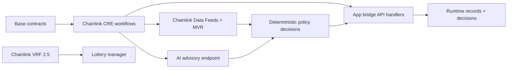

# Converge | A Chainlink Hackathon Submission

Converge is a scoped hackathon submission from the 4626 codebase, focused only on Chainlink-powered automation.

- Tracks: **DeFi & Tokenization**, **CRE & AI**
- Public source code: <https://github.com/4626fun/convergence-chainlink-hackathon>
- Public demo video (3-5 min): `TBD`
- Requirement mapping: [`docs/hackathon/chainlink-cre-submission.md`](docs/hackathon/chainlink-cre-submission.md)
- Video script: [`docs/hackathon/video-script.md`](docs/hackathon/video-script.md)
- Full A-I writeup: [`docs/hackathon/chainlink-cre-a-to-i.md`](docs/hackathon/chainlink-cre-a-to-i.md)
- Submission form copy: [`docs/hackathon/submission-form-copy.md`](docs/hackathon/submission-form-copy.md)
- Final submission checklist: [`docs/hackathon/final-submission-checklist.md`](docs/hackathon/final-submission-checklist.md)

## Judge Quickstart (2 Minutes)

1. Read the requirement mapping doc: [`docs/hackathon/chainlink-cre-submission.md`](docs/hackathon/chainlink-cre-submission.md).
2. From `cre/cre-workflows`, run:
   - `cre workflow simulate ./payout-integrity --target local-simulation`
   - `cre workflow simulate ./keepr-queue --target local-simulation`
3. Open simulation proof snapshots under [`docs/hackathon/evidence/`](docs/hackathon/evidence/).
4. Confirm Chainlink file inventory: [`cre/README.md#files-using-chainlink`](cre/README.md#files-using-chainlink).
5. Watch the 3-5 minute walkthrough (replace `TBD` URL above before submitting).

## Project Description (Use Case + Architecture)

4626 secures creator-vault value flows where onchain state, offchain systems, and operator actions must stay consistent.  
This submission shows Chainlink-based orchestration that detects risk conditions, validates payout wiring, and executes deterministic workflow decisions with replay-safe persistence.

### Stack

- **Onchain**: Base/EVM contracts for vault, gauge, lottery, and payout routes.
- **Chainlink**: CRE workflows, Data Feeds + MVR reads, VRF 2.5 randomness.
- **Offchain**: API bridge handlers and runtime persistence for ingest/decision checkpoints.
- **AI path**: Advisory AI assessment endpoint used by CRE workflow; deterministic checks remain authoritative.



## Chainlink Products Used

| Product | Strength contributed | Where used |
|---|---|---|
| **CRE** | Verified offchain computation with deterministic trigger/capability orchestration | `cre/cre-workflows/**` |
| **Data Feeds + MVR** | Accurate, reliable, hard-to-manipulate oracle reference data | `cre/cre-workflows/runtime-reference-feeds/main.ts` |
| **VRF 2.5** | Tamper-proof randomness with cryptographic proof tied to request lifecycle | `contracts/utilities/lottery/vrf/CreatorVRFConsumerV2_5.sol`, `contracts/utilities/lottery/vrf/ChainlinkVRFIntegratorV2_5.sol` |

## CRE Workflows In Scope

| Workflow | Trigger | Blockchain + external integration |
|---|---|---|
| `payout-integrity` | Cron | EVM reads + HTTP bridge + AI advisory |
| `keepr-queue` | Cron | HTTP orchestration for pending keeper actions |
| `runtime-indexer-block` | HTTP webhook | Blockchain block stream payload -> runtime ingest API |
| `runtime-indexer-data-fetch` | Cron | GraphQL/API pull -> runtime ingest API |
| `runtime-reference-feeds` | Cron | Chainlink feed reads + MVR decode -> runtime ingest API |
| `runtime-orchestrator` | Cron + HTTP | Durable checkpoint + decisioning -> runtime decisions API |

## Requirement Checklist

- [x] Project description with use case and architecture stack.
- [x] 3-5 minute video script included (`docs/hackathon/video-script.md`), public link placeholder included (`TBD`).
- [x] Public source code in this public repo.
- [x] README links to files that use Chainlink.
- [x] Sponsor-prize mapping/checklist documented in `docs/hackathon/chainlink-cre-submission.md`.
- [x] CRE workflows are built and simulated within this project.
- [x] Workflow integration includes blockchain + external API/system/AI, with successful CRE CLI simulations committed as evidence.

## Files Using Chainlink

Canonical inventory (full list):
- [`cre/README.md#files-using-chainlink`](cre/README.md#files-using-chainlink)

Hackathon-critical files:
- [`cre/cre-workflows/project.yaml`](cre/cre-workflows/project.yaml)
- [`cre/cre-workflows/payout-integrity/main.ts`](cre/cre-workflows/payout-integrity/main.ts)
- [`cre/cre-workflows/payout-integrity/workflow.yaml`](cre/cre-workflows/payout-integrity/workflow.yaml)
- [`cre/cre-workflows/keepr-queue/main.ts`](cre/cre-workflows/keepr-queue/main.ts)
- [`cre/cre-workflows/keepr-queue/workflow.yaml`](cre/cre-workflows/keepr-queue/workflow.yaml)
- [`cre/cre-workflows/runtime-indexer-block/main.ts`](cre/cre-workflows/runtime-indexer-block/main.ts)
- [`cre/cre-workflows/runtime-indexer-data-fetch/main.ts`](cre/cre-workflows/runtime-indexer-data-fetch/main.ts)
- [`cre/cre-workflows/runtime-reference-feeds/main.ts`](cre/cre-workflows/runtime-reference-feeds/main.ts)
- [`cre/cre-workflows/runtime-orchestrator/main.ts`](cre/cre-workflows/runtime-orchestrator/main.ts)
- [`frontend/api/_handlers/cre/keeper/_aiAssess.ts`](frontend/api/_handlers/cre/keeper/_aiAssess.ts)
- [`frontend/server/agent/eliza/llm.ts`](frontend/server/agent/eliza/llm.ts)
- [`frontend/api/_handlers/cre/runtime/_ingest.ts`](frontend/api/_handlers/cre/runtime/_ingest.ts)
- [`frontend/api/_handlers/cre/runtime/_decisions.ts`](frontend/api/_handlers/cre/runtime/_decisions.ts)
- [`frontend/server/_lib/cre/runtimeBridge.ts`](frontend/server/_lib/cre/runtimeBridge.ts)
- [`contracts/utilities/lottery/vrf/CreatorVRFConsumerV2_5.sol`](contracts/utilities/lottery/vrf/CreatorVRFConsumerV2_5.sol)
- [`contracts/utilities/lottery/vrf/ChainlinkVRFIntegratorV2_5.sol`](contracts/utilities/lottery/vrf/ChainlinkVRFIntegratorV2_5.sol)

## Simulation Runbook (Exact Commands)

Run from `cre/cre-workflows`:

```bash
# Terminal A
set -a && source .env && set +a
node ../scripts/hackathon/mock-cre-api-server.mjs

# Terminal B
cre workflow simulate ./payout-integrity --target local-simulation
cre workflow simulate ./keepr-queue --target local-simulation
cre workflow simulate runtime-indexer-block --target local-simulation --non-interactive --trigger-index 0 --http-payload @test-block.json
cre workflow simulate runtime-indexer-data-fetch --target local-simulation --non-interactive --trigger-index 0
cre workflow simulate runtime-reference-feeds --target local-simulation --non-interactive --trigger-index 0
cre workflow simulate runtime-orchestrator --target local-simulation --non-interactive --trigger-index 0
cre workflow simulate runtime-orchestrator --target local-simulation --non-interactive --trigger-index 1 --http-payload @http_trigger_payload.json
```

## Simulation Evidence (Committed)

- [`docs/hackathon/evidence/cre-payout-integrity-local-simulation.md`](docs/hackathon/evidence/cre-payout-integrity-local-simulation.md)
- [`docs/hackathon/evidence/cre-keepr-queue-local-simulation.md`](docs/hackathon/evidence/cre-keepr-queue-local-simulation.md)
- [`docs/hackathon/evidence/cre-runtime-indexer-block-local-simulation.md`](docs/hackathon/evidence/cre-runtime-indexer-block-local-simulation.md)
- [`docs/hackathon/evidence/cre-runtime-indexer-data-fetch-local-simulation.md`](docs/hackathon/evidence/cre-runtime-indexer-data-fetch-local-simulation.md)
- [`docs/hackathon/evidence/cre-runtime-reference-feeds-local-simulation.md`](docs/hackathon/evidence/cre-runtime-reference-feeds-local-simulation.md)
- [`docs/hackathon/evidence/cre-runtime-orchestrator-cron-local-simulation.md`](docs/hackathon/evidence/cre-runtime-orchestrator-cron-local-simulation.md)
- [`docs/hackathon/evidence/cre-runtime-orchestrator-http-local-simulation.md`](docs/hackathon/evidence/cre-runtime-orchestrator-http-local-simulation.md)

