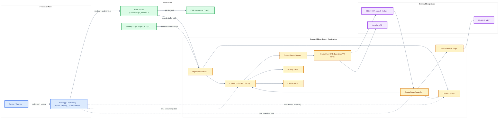
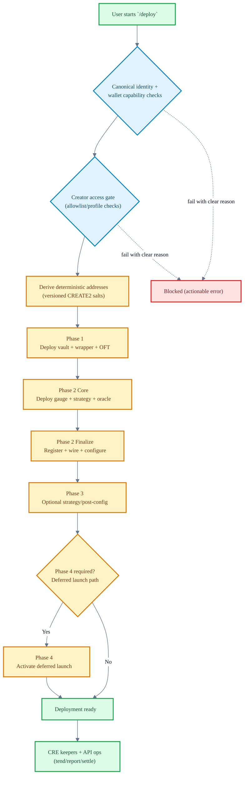
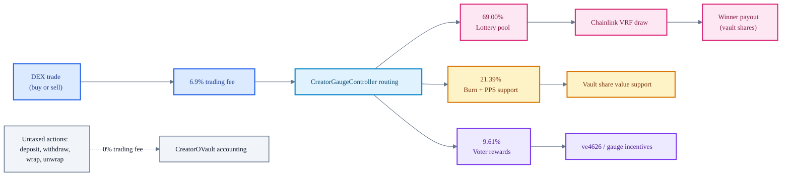
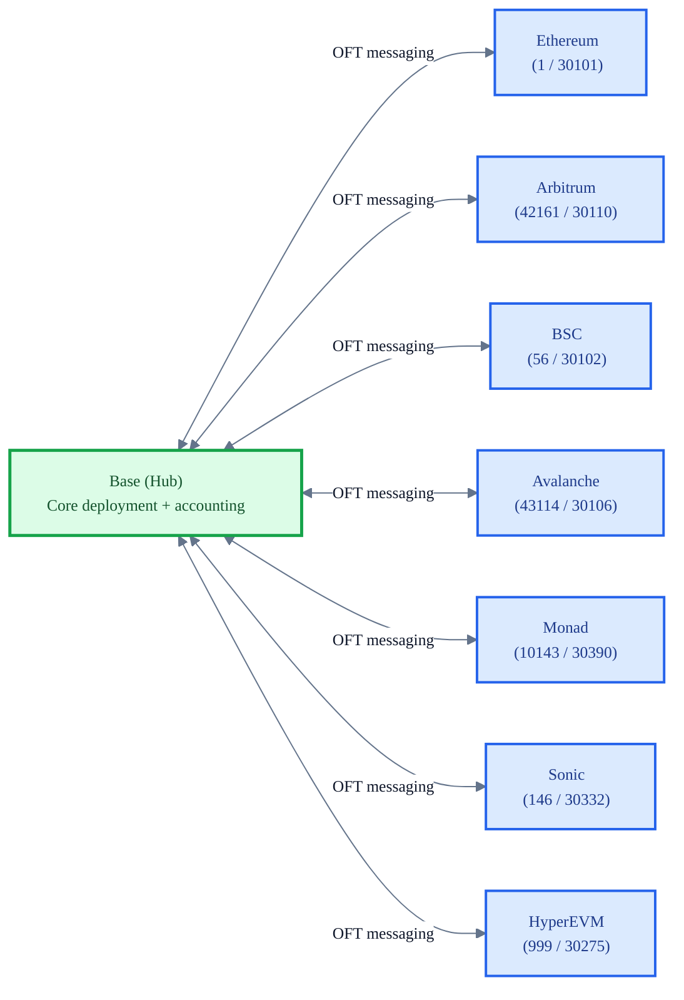

# 4626.fun

4626.fun is a Base-native protocol + app stack for launching creator-centered vault economies.
It combines ERC-4626 vaults, account abstraction, cross-chain OFT shares, and a fee-driven incentive layer for creator coins.

[](LICENSE)
[](https://docs.soliditylang.org/)
[](https://layerzero.network/)
[](https://github.com/wenakita/4626/actions/workflows/test.yml)

## Chainlink Hackathon Submission (CRE + AI)

This public repo is a scoped submission mirror for the Chainlink hackathon.

- Tracks covered:
  - **DeFi & Tokenization**
  - **CRE & AI**
- Core orchestration workflow:
  - `cre/cre-workflows/payout-integrity/main.ts` (onchain checks + external HTTP + AI advisory)

Submission links:
- Files using Chainlink: [`cre/README.md#files-using-chainlink`](cre/README.md#files-using-chainlink)
- Requirement mapping checklist: [`docs/hackathon/chainlink-cre-submission.md`](docs/hackathon/chainlink-cre-submission.md)
- Simulation evidence snapshots:
  - [`docs/hackathon/evidence/cre-payout-integrity-local-simulation.md`](docs/hackathon/evidence/cre-payout-integrity-local-simulation.md)
  - [`docs/hackathon/evidence/cre-keepr-queue-local-simulation.md`](docs/hackathon/evidence/cre-keepr-queue-local-simulation.md)
- 3-5 minute video runbook: [`docs/hackathon/video-script.md`](docs/hackathon/video-script.md)

## Quick Navigation

- [What This Repository Contains](#what-this-repository-contains)
- [System Atlas](#system-atlas)
  - [Architecture (Experience -> Control -> Protocol)](#1-architecture-experience---control---protocol)
  - [Deployment Lifecycle](#2-deployment-lifecycle-phased-and-guarded)
  - [Fee + Incentive Routing](#3-fee--incentive-routing)
  - [Omnichain Topology](#4-omnichain-share-topology-base-hub)
- [Core Protocol Components](#core-protocol-components)
- [Supported Chains](#supported-chains-current-configuration)
- [Quick Start (Local Development)](#quick-start-local-development)
- [Testing and Build Commands](#testing-and-build-commands)
- [Frontend Routes and API Surface](#frontend-routes-and-api-surface)
- [Environment and Secrets](#environment-and-secrets)
- [Security and Invariants](#security-and-invariants)
- [Documentation Map](#documentation-map)
- [Repository Layout](#repository-layout)

## What This Repository Contains

4626 focuses on three outcomes:

- Launch creator vault infrastructure from a single user flow (`/deploy`).
- Route creator coin activity into vault and incentive mechanics.
- Operate lifecycle + maintenance through automated keepers and API-driven workflows.

This monorepo includes:

- Smart contracts (`contracts/`) for vaults, gauges, lottery, wrappers, OFT, and deploy infra.
- Frontend app (`frontend/`) using Vite + React with local/Vercel API handlers.
- CRE automation workflows (`cre/`) for tending, reporting, settlement, and queue operations.
- Docusaurus docs site (`apps/docs-site/`) fed by `docs/` content and generated references.

## System Atlas

### 1) Architecture (Experience -> Control -> Protocol)



### 2) Deployment Lifecycle (Phased and Guarded)

Creator deployment is exposed as one user flow, but executed as guarded phases with deterministic addresses and prechecks.



### 3) Fee + Incentive Routing

The documented model applies a 6.9% trading fee to DEX trades (buy + sell), then routes proceeds through the gauge controller.



### 4) Omnichain Share Topology (Base Hub)

4626 is Base-hub-first with omnichain share transport via LayerZero V2 OFT.



## Core Protocol Components

| Component | Role |
|-----------|------|
| `CreatorRegistry` | Canonical registry of creator coin -> vault stack mappings and chain config |
| `CreatorOVault` | ERC-4626 vault for creator coin deposits and strategy accounting |
| `CreatorOVaultWrapper` | Wraps vault shares into transportable OFT-compatible share form |
| `CreatorShareOFT` | LayerZero V2 OFT share token with DEX-aware fee hooks |
| `CreatorGaugeController` | Receives and routes trading-fee proceeds to downstream sinks |
| `CreatorLotteryManager` | Executes lottery odds/payout flow with VRF randomness |
| `CreatorOracle` | Price and accounting inputs for vault/share mechanics |
| `CreatorCCAStrategy` | CCA launch path and post-auction liquidity transition |

## Supported Chains (Current Configuration)

Source of truth: `docs/chains.md`.

| Network | Chain ID | LayerZero Endpoint ID | Status |
|---------|----------|-----------------------|--------|
| Base | 8453 | 30184 | Hub chain |
| Ethereum | 1 | 30101 | Configured |
| Arbitrum | 42161 | 30110 | Configured |
| BSC | 56 | 30102 | Configured |
| Avalanche | 43114 | 30106 | Configured |
| Monad | 10143 | 30390 | Configured |
| Sonic | 146 | 30332 | Configured |
| HyperEVM | 999 | 30275 | Configured |

## Quick Start (Local Development)

### Prerequisites

- Node.js 20+
- `pnpm` (root/frontend/docs)
- `npm` (CRE package install and scripts)
- Foundry (`forge`) for Solidity build/test

### 1) Clone and install

```bash
git clone https://github.com/wenakita/4626.git
cd 4626

# root
pnpm install

# frontend
pnpm -C frontend install

# docs (optional if app-only)
pnpm -C apps/docs-site install

# cre
npm --prefix cre install
```

### 2) Configure local env files

```bash
# root / contracts
cp .env.example .env

# frontend
cp frontend/.env.example frontend/.env

# cre
cp cre/secrets.example.env cre/.env
```

Keep real secrets in local env files or your deployment secret manager; do not commit secrets.

### 3) Run services

```bash
# app (default: http://localhost:5173)
pnpm -C frontend dev

# cre workflows (optional)
npm --prefix cre run start

# docs site (optional, default: http://localhost:3000)
pnpm -C apps/docs-site start
```

## Testing and Build Commands

### Common validation commands

| Surface | Commands |
|--------|----------|
| Frontend | `pnpm -C frontend test`<br/>`pnpm -C frontend typecheck`<br/>`pnpm -C frontend lint` |
| CRE | `npm --prefix cre test`<br/>`npm --prefix cre run typecheck` |
| Contracts | `forge build`<br/>`forge test -vvv` |
| Frontend build | `pnpm -C frontend build` |
| Docs build | `pnpm -C apps/docs-site build` |

## Frontend Routes and API Surface

### Primary frontend routes

| Route | Purpose |
|-------|---------|
| `/` | Landing and navigation entry |
| `/deploy` | Creator deployment and activation flow |
| `/waitlist` | Waitlist onboarding path |
| `/vault/:address` | Vault interaction surface |
| `/dashboard` | Legacy redirect path |
| `/launch` | Legacy redirect to deploy flow |

### API routing model

- Production entrypoint: `frontend/api/[...path].ts`
- Handler modules: `frontend/api/_handlers/*`
- Local dev API mapping: `frontend/vite.config.ts`

Important bundling rule: register endpoints through static route mapping in `frontend/api/_handlers/_routes.ts`; do not rely on ad hoc dynamic imports for production handler inclusion.

## Environment and Secrets

### Core frontend/server variables (examples)

| Variable | Scope | Purpose |
|----------|-------|---------|
| `VITE_CDP_PAYMASTER_URL` | client | Optional paymaster/bundler override |
| `CDP_PAYMASTER_URL` | server | Paymaster endpoint for server handlers |
| `VITE_ZORA_PUBLIC_API_KEY` | client | Public Zora integration key |
| `ZORA_SERVER_API_KEY` | server | Server-side Zora API access |
| `BASE_RPC_URL` | server | Base RPC URL for handlers/workflows |
| `DATABASE_URL` | server | Database connectivity |
| `AUTH_SESSION_SECRET` | server | Auth session signing secret |
| `PRIVY_APP_ID` / `PRIVY_APP_SECRET` | server | Privy integration keys |

### Core CRE variables (examples)

| Variable | Purpose |
|----------|---------|
| `KEEPR_PRIVATE_KEY` | Keeper signer for workflow-triggered writes |
| `KEEPR_API_BASE_URL` | Target API base URL for keeper bridge |
| `KEEPR_API_KEY` | Auth between CRE workflows and API |

For complete env references, see `frontend/README.md` and `cre/README.md`.

## Security and Invariants

- Frontend API routing and auth boundaries are enforced in `frontend/api` + `frontend/server/auth`.
- Wallet/account invariants are documented in `.cursor/rules/ERC-4337-Wallet-Invariants.mdc`.
- Deploy/session ownership + creator access checks are enforced server-side before phased execution.
- CRE automation uses an HTTP bridge pattern; write execution happens through audited API surfaces.

## Documentation Map

- Root docs index: `docs/index.md`
- Narrative architecture model: `docs/compressions/index.md`
- Primitive model (account/market/game loop): `docs/primitives/index.md`
- Deployment operations: `docs/operations/deployment/index.md`
- Current contract inventory: `docs/current-contract-inventory.md`
- Security docs: `docs/security/index.md`
- Frontend guide: `frontend/README.md`
- CRE guide: `cre/README.md`

## Cloud Agent Onboarding

Cursor Cloud Agent config is committed under `.cursor/`:

- `.cursor/environment.json`
- `.cursor/install.sh`
- `.cursor/start.sh`
- `.cursor/sandbox.json`

Runbook:

- `docs/operations/cursor-cloud-agent-onboarding.md`

## Repository Layout

| Path | Purpose |
|------|---------|
| `contracts/` | Protocol smart contracts and related components |
| `script/` | Foundry scripts for deploy/ops |
| `frontend/` | Vite React app + local/Vercel API handlers |
| `cre/` | CRE workflow runners, scripts, and tests |
| `apps/docs-site/` | Docusaurus documentation site |
| `docs/` | Product, architecture, operations, and reference docs |
| `deployments/` | Deployment artifacts and addresses |

## Contributing

1. Branch from `main`.
2. Keep changes scoped (contracts, frontend, CRE, docs).
3. Run relevant tests before opening a PR.
4. Include migration or ops notes when behavior changes.

## License

MIT - AKITA, LLC
