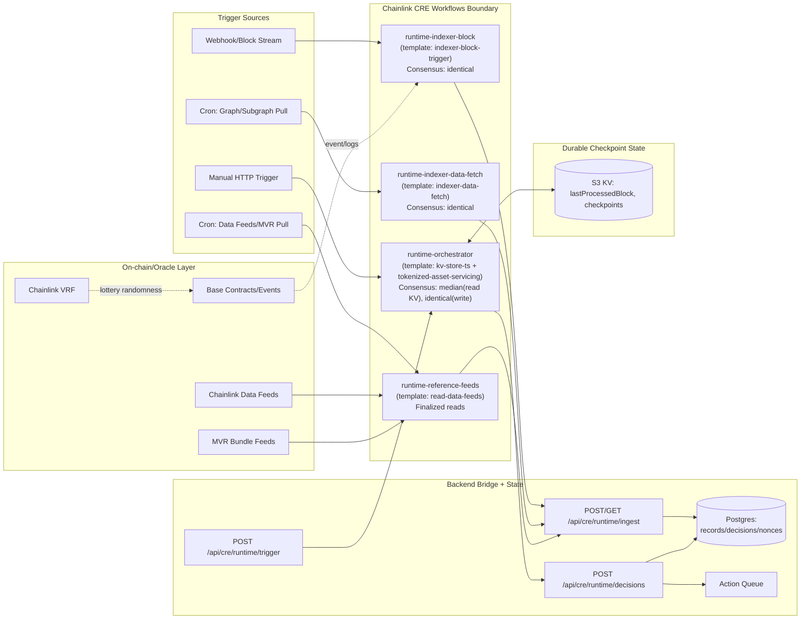

# Chainlink CRE A-I Plan and Implementation

This document packages the comprehensive A-I deliverable for 4626's Chainlink CRE integration in a single submission-ready file.

## A) Problem statement + value-secure thesis

### Assumptions

- 4626 is a creator-vault protocol with ERC-4626 vault accounting, strategy allocation, fee routing, and VRF lottery flows.
- Value at stake includes vault collateral, strategy allocations (Ajna/Charm/idle), payout routing, and lottery outcomes.
- Initial runtime target is Base plus off-chain API/DB integrations, with cross-chain expansion on the roadmap.

### Problem statement (plain English)

4626 has value-critical decisions that depend on both on-chain and off-chain inputs (events, pricing, checkpoints, queue actions). Without deterministic orchestration, the protocol risks stale inputs, duplicate execution, replay abuse, and operator race conditions. Those failure modes can leak value via bad rebalances, delayed settlements, wrong payouts, or inconsistent state between chains/services.

### Value-secure thesis

This architecture secures value by combining:

- Blockchain primitives for immutable event logs, auditable state transitions, and finality-aware reads.
- Chainlink Data Feeds and MVR for accurate reliable non-manipulatable price/reference inputs.
- Chainlink VRF for tamper-proof number generation with cryptographic proof that the number came from the request path.
- Chainlink CRE for verified off-chain computation and deterministic workflow orchestration across triggers and capabilities.
- (Roadmap) CCIP for standardized cross-chain messaging and value-transfer semantics, replacing ad-hoc bridge glue with explicit message handling and replay controls.

Template-first mapping is locked in `cre/cre-workflows/TEMPLATE_MAP.md` and workflows are adapted from official CRE templates.

## B) Threat model (bullets)

- Oracle/input manipulation risk  
  Mitigation: Chainlink Data Feeds plus MVR reads with finalized-block anchored chain reads and deterministic normalization.
- Replay and duplicate execution risk  
  Mitigation: idempotency keys (content-derived), nonce replay table, dedupe keys, unique DB constraints.
- Off-chain tampering risk  
  Mitigation: signed webhook model (Bearer plus optional HMAC), canonical JSON hashing, audit persistence.
- Nondeterministic off-chain compute risk  
  Mitigation: CRE consensus aggregations (`consensusIdenticalAggregation`, `consensusMedianAggregation`), stable sort/stringify helpers, fixed execution order.
- Reorg/stale-state risk  
  Mitigation: finalized-height reads for feed workflows, checkpoint progression and bounded polling patterns.
- Cross-chain relay/bridge fragility (roadmap)  
  Mitigation: CCIP message schemas, nonce/replay controls, finality windows, compensation paths for failed deliveries.
- Randomness manipulation risk for payouts/lottery  
  Mitigation: Chainlink VRF 2.5 on-chain verification path and request-bound proof.

## C) Architecture diagram (Mermaid)



## D) Workflow breakdown (2-4 workflows)

| Workflow | Trigger | Inputs (config + secrets) | Outputs | Determinism + Idempotency | Template source |
|---|---|---|---|---|---|
| `runtime-indexer-block` | HTTP webhook trigger | `apiBaseUrl`, `watchedAddresses`, `workflowName`; secret: `KEEPR_API_KEY` | `POST /api/cre/runtime/ingest` (`kind=block`) | Stable tx sort + hash-derived idempotency key; identical aggregation for sink calls | `indexer-block-trigger` |
| `runtime-indexer-data-fetch` | Cron | `graphqlEndpoint`, `query`, `variables`, `workflowName`; secret: `KEEPR_API_KEY` | `POST /api/cre/runtime/ingest` (`kind=metrics`) | Stable Graph snapshot serialization + digest; identical aggregation | `indexer-data-fetch` |
| `runtime-reference-feeds` | Cron | `chainName`, `feeds`, `mvrFeeds`, `workflowName`; secret: `KEEPR_API_KEY` | `POST /api/cre/runtime/ingest` (`kind=feeds`) | Reads anchored to `LAST_FINALIZED_BLOCK_NUMBER`; stable payload digest | `read-data-feeds` |
| `runtime-orchestrator` | Cron + HTTP manual | checkpoint params + thresholds + optional mocks; secrets: `KEEPR_API_KEY`, `AWS_ACCESS_KEY_ID`, `AWS_SECRET_ACCESS_KEY` | `POST /api/cre/runtime/decisions`; optional queue enqueue | Median aggregation for KV numeric reads; identical writes/sink; slot/manual idempotency keys | `kv-store-ts`, `tokenized-asset-servicing`, `bring-your-own-data` |

## E) Chainlink product strengths table

| Chainlink Product | What risk it mitigates | What strength it contributes | Where it appears in the architecture | Failure modes and fallback strategy |
|---|---|---|---|---|
| Chainlink Price Feeds (Data Feeds) | Oracle spoofing/manipulation and stale price reliance | Accurate reliable non-manipulatable price delivery from decentralized oracle network; consistent decimal handling | `runtime-reference-feeds` EVM reads | If feed read fails: hold previous checkpointed decision, do not rebalance; alert and retry/backoff |
| Chainlink VRF 2.5 | Manipulated winner selection/order bias | Tamper-proof number with cryptographic proof number was generated from request | On-chain lottery contracts plus payout path | If fulfillment delayed: no winner finalization until valid proof path resolves |
| Chainlink CRE | Nondeterministic/off-chain tampering, brittle cron glue | Verified off-chain computation plus deterministic workflow orchestration (consensus aggregation + reproducibility) | `cre/cre-workflows/runtime-*`, bridge endpoints | If sink/API fails: deterministic retries, idempotency keys, replay-safe writes, no duplicate side effects |
| Chainlink CCIP (roadmap) | Ad-hoc bridge message/value transfer risk | Standardized cross-chain messaging plus value-transfer semantics with configurable security model | Planned cross-chain rebalance/settlement pipeline | If message delivery fails: nonce-based replay protection, status polling, compensating action workflow |

## F) Repo tree

```text
cre/cre-workflows/
  TEMPLATE_MAP.md
  project.yaml
  package.json
  secrets.yaml
  _shared/
    determinism.ts
    http.ts
    kvState.ts
  runtime-indexer-block/
    main.ts
    workflow.yaml
    config.local-simulation.json
    config.staging.json
    config.production.json
    test-block.json
  runtime-indexer-data-fetch/
    main.ts
    workflow.yaml
    config.local-simulation.json
    config.staging.json
    config.production.json
  runtime-reference-feeds/
    main.ts
    workflow.yaml
    config.local-simulation.json
    config.staging.json
    config.production.json
  runtime-orchestrator/
    main.ts
    workflow.yaml
    config.local-simulation.json
    config.staging.json
    config.production.json
    http_trigger_payload.json

frontend/server/_lib/cre/
  runtimeSchema.ts
  runtimeBridge.ts

frontend/api/_handlers/cre/runtime/
  _ingest.ts
  _decisions.ts
  _trigger.ts

frontend/api/__tests__/
  creRuntimeBridge.test.ts

docs/
  cre-runtime-api.md
  cre-runtime-hardening-checklist.md
```

## G) Full code listings (no pseudo-code)

The implementation uses production code already present in the repo files listed in section F. The snippets below show key deterministic and security-critical paths used by the workflows and bridge:

```ts
// cre/cre-workflows/_shared/determinism.ts
export function stableJsonStringify(value: unknown): string {
  return JSON.stringify(stableClone(value))
}

export function sha256Hex(value: string): string {
  return bytesToHex(sha256(new TextEncoder().encode(value)))
}

export function stableSortStrings(values: string[]): string[] {
  return [...values].sort((a, b) => a.localeCompare(b))
}
```

```ts
// cre/cre-workflows/runtime-reference-feeds/main.ts
const decimalsResp = evmClient.callContract(runtime, {
  call: encodeCallMsg({
    from: zeroAddress,
    to: feed.address as Address,
    data: decimalsData,
  }),
  blockNumber: LAST_FINALIZED_BLOCK_NUMBER,
}).result()
```

```ts
// cre/cre-workflows/runtime-orchestrator/main.ts
const previousCheckpoint = runtime.config.kvDisabled
  ? Math.max(0, Math.floor(runtime.config.initialCheckpoint ?? 0))
  : runtime.runInNodeMode(
      (nodeRuntime: NodeRuntime<Config>) => {
        return readKvNumber(nodeRuntime, httpClient, awsCreds!, now)
      },
      consensusMedianAggregation<number>(),
    )().result()
```

```ts
// frontend/server/_lib/cre/runtimeBridge.ts
const bodyCanonical = stableJsonStringify(body)
const signedPayload = `${tsRaw}.${nonce}.${bodyCanonical}`
const expectedSignature = createHmac("sha256", hmacSecret).update(signedPayload).digest("hex")
const providedSignature = normalizeSignatureHeader(signatureRaw)
if (!safeEqualsHex(expectedSignature, providedSignature)) {
  return { ok: false, status: 401, error: "Invalid runtime request signature", correlationId }
}
```

```ts
// frontend/api/_handlers/_routes.ts
'cre/runtime/ingest': () => import('./cre/runtime/_ingest.js'),
'cre/runtime/decisions': () => import('./cre/runtime/_decisions.js'),
'cre/runtime/trigger': () => import('./cre/runtime/_trigger.js'),
```

## H) Runbook (exact commands)

### 1) Install dependencies

```bash
# repo root
pnpm install
pnpm -C frontend install
npm --prefix cre install
```

```bash
# CRE workflow workspace
cd cre/cre-workflows
bun install
```

### 2) Authenticate CRE CLI

```bash
cre login
cre version
```

### 3) Set local simulation secrets

```bash
export KEEPR_API_KEY_VALUE="local-dev-key"
export KEEPR_API_BASE_URL_VALUE="http://127.0.0.1:8789/api"
export KEEPR_PRIVATE_KEY_VALUE="0x0000000000000000000000000000000000000000000000000000000000000001"
export CRE_RUNTIME_WEBHOOK_HMAC_SECRET_VALUE="local-hmac-secret"
export AWS_ACCESS_KEY_ID_VALUE="AKIALOCALTEST"
export AWS_SECRET_ACCESS_KEY_VALUE="local-secret"

# Recommended hardening toggles for staging/production bridge:
export CRE_RUNTIME_ENFORCE_HMAC="true"
# Optional temporary migration override (disable before final launch):
# export CRE_RUNTIME_ALLOW_UNSIGNED_WHEN_HMAC_CONFIGURED="true"
```

### 4) Start local mock bridge

```bash
# repo root
CRE_MOCK_API_KEY="local-dev-key" node cre/scripts/hackathon/mock-cre-api-server.mjs
```

### 5) Simulate runtime workflows (verified)

```bash
cd cre/cre-workflows

cre workflow simulate runtime-indexer-block \
  --target local-simulation \
  --non-interactive \
  --trigger-index 0 \
  --http-payload @test-block.json

cre workflow simulate runtime-indexer-data-fetch \
  --target local-simulation \
  --non-interactive \
  --trigger-index 0

cre workflow simulate runtime-reference-feeds \
  --target local-simulation \
  --non-interactive \
  --trigger-index 0

cre workflow simulate runtime-orchestrator \
  --target local-simulation \
  --non-interactive \
  --trigger-index 0

cre workflow simulate runtime-orchestrator \
  --target local-simulation \
  --non-interactive \
  --trigger-index 1 \
  --http-payload @http_trigger_payload.json
```

### 6) Typecheck workflows

```bash
bash cre/cre-workflows/scripts/typecheck-workflows.sh
```

### 7) Stage/prod secrets for CRE

```bash
cre secrets set KEEPR_API_KEY
cre secrets set KEEPR_API_BASE_URL
cre secrets set KEEPR_PRIVATE_KEY
cre secrets set CRE_RUNTIME_WEBHOOK_HMAC_SECRET
cre secrets set AWS_ACCESS_KEY_ID
cre secrets set AWS_SECRET_ACCESS_KEY

# (optional) restrict /api/cre/runtime/trigger to approved workflow IDs
export CRE_RUNTIME_ALLOWED_TRIGGER_WORKFLOW_IDS="<64-hex-workflow-id-1>,<64-hex-workflow-id-2>"
```

### 8) Run backend bridge

```bash
pnpm -C frontend dev
```

Bridge endpoints:

- `POST/GET /api/cre/runtime/ingest`
- `POST /api/cre/runtime/decisions`
- `POST /api/cre/runtime/trigger`

## I) Roadmap (Phase 0-3+)

### Phase 0: MVP (local simulation -> staging)

- Keep 4 runtime workflows as-is (block, data fetch, reference feeds, orchestrator).
- Enforce deterministic aggregation + idempotency + replay protection.
- Add structured observability (correlation IDs, workflow IDs, idempotency keys).
- Exit criteria: reproducible simulation output, staging deploys, no duplicate decision writes.

### Phase 1: Rebalancer (portfolio/treasury/collateral management)

- Define rebalance objective: target weights across Ajna/Charm/idle, risk bands, max drift.
- Inputs: feed prices, position sizes, liquidity constraints, policy limits.
- Process: deterministic CRE compute -> produce signed decision payload -> execute via approved bridge/on-chain layer.
- Safety controls: max slippage, per-epoch notional cap, circuit breaker, timelock option, human-approve mode.
- State and audit: checkpoints in KV + decision log in Postgres (`cre_runtime_decisions`).

### Phase 2: CCIP bridge (cross-chain messaging/value movement)

- Promote cross-chain flows: collateral sync, cross-chain settlement commands, position attestations.
- Message schema versioning (example fields): `messageId`, `srcChain`, `dstChain`, `workflowDecisionId`, `actionType`, `payloadHash`, `nonce`, `deadline`.
- Replay/finality: nonce uniqueness + destination replay table + chain-finality confirmation windows.
- Failure handling: retries with bounded backoff, dead-letter queue, compensation workflow.
- CRE integration: CRE decides and emits CCIP-intent messages; downstream verifies receipts/events and updates state.

### Phase 3+: advanced security and multi-product composition

- Multi-source pricing policy (primary feeds + deterministic fallback path).
- VRF-backed fair allocation extensions where randomness is value-sensitive.
- PoR/NAV style publisher workflows (`bring-your-own-data` pattern) for external reserve/asset attestations.
- Progressive migration from HTTP bridge writes toward native report-receiver pathways and broader multi-chain ops hardening.
